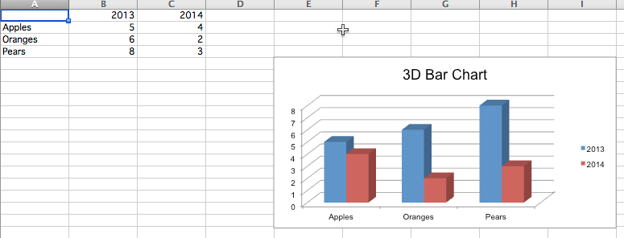

Bar and Column Charts
=====================

In bar charts values are plotted as either horizontal bars or vertical columns.

Vertical, Horizontal and Stacked Bar Charts
-------------------------------------------

.. literalinclude:: bar.py

This will produce three charts illustrating the various possibilities. Note that when the bars are horizontal the x and y axes are revesed.

.. image:: bar.png
   :alt: "Sample bar charts"

3D Bar Charts
-------------

You can also create 3D bar charts

.. literalinclude:: bar3d.py

This produces a simple 3D bar chart

