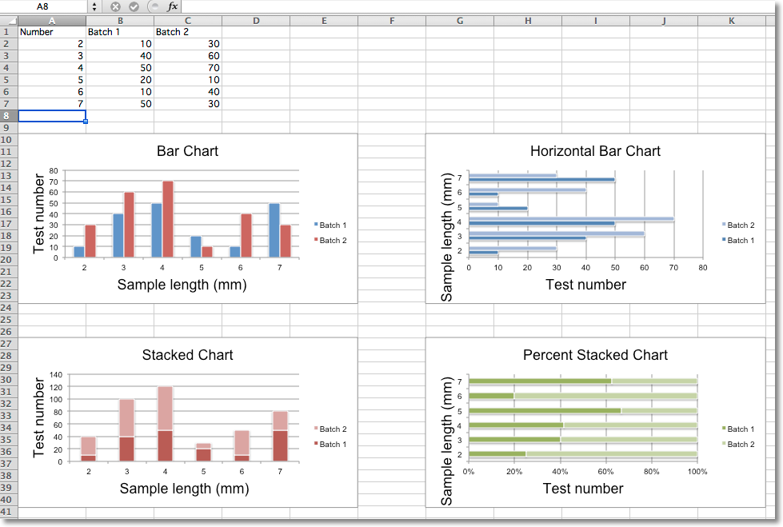

Bar and Column Charts
=====================

In bar charts values are plotted as either horizontal bars or vertical columns.

.. literalinclude:: bar.py

This will produce three charts illustrating the various possibilities. Note that when the bars are horizontal the x and y axes are revesed.

