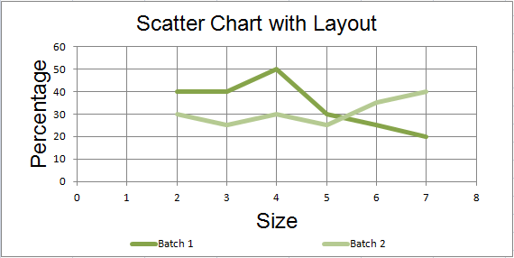

Changing the layout of plot area and legend
=====================

The layout is set by assigning the layout property an instance of a layout class.

.. literalinclude:: chart_layout.py

This produces a chart looking something like this:

