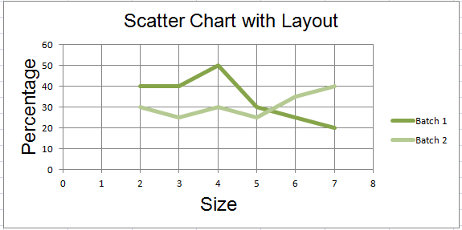

Changing the layout of plot area and legend
===========================================

The layout of the chart within the canvas can be set by using the layout
property an instance of a layout class.

.. literalinclude:: chart_layout.py

This produces a chart looking something like this:

.. image:: chart_layout.png
   :alt: "Sample chart with the layout of the legend and plot area manually set"

To be compared with the default layout:

