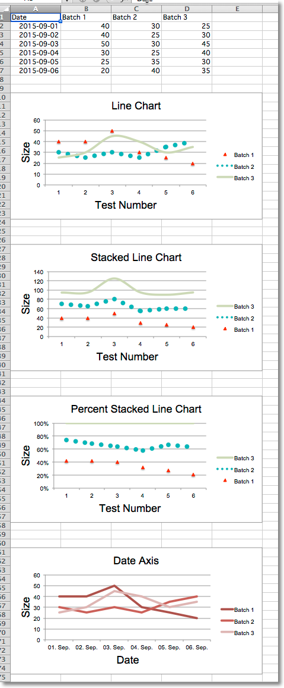

Line Charts
===========

Line charts allow data to be plotted against a fixed axis. They are similar
to scatter charts, the main difference is that with line charts each data
series is plotted against the same values. Different kinds of axes can be
used for the secondary axes.

.. literalinclude:: line.py

