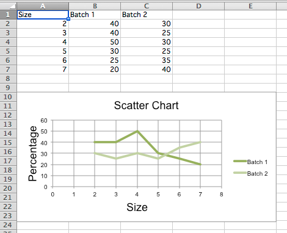

Scatter Charts
==============

Scatter, or xy, charts are similar to some line charts. The main difference is that one series of values is plotted against another. This is useful where values are unordered.

.. literalinclude:: scatter.py

